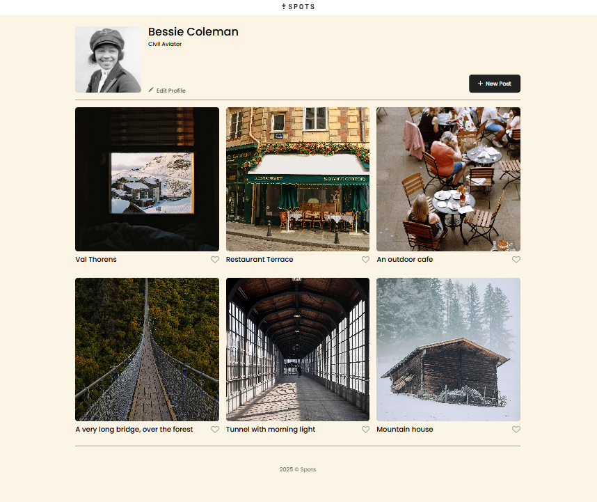
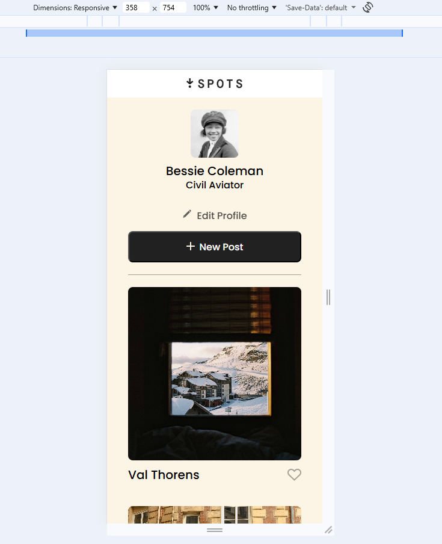

## Project 3: Spots

## Description

This project is a responsive web page that allows users to view a profile section and interact with buttons such as editing a profile and creating a new post. The layout adapts to different screen sizes and follows modern HTML and CSS best practices.

## Functionality

- Responsive profile layout
- Edit Profile button
- New Post button
- Grid-based card layout
- Hover effects and accessible buttons
- Clean, semantic HTML structure

## Technologies & Techniques Used

- HTML5
- CSS3
- Flexbox
- CSS Grid
- BEM (Block Element Modifier) methodology
- Responsive design with media queries
- Accessibility best practices (aria-labels, semantic elements)

## Deployment

This webpage is deployed to GitHub Pages

- [Deployment Link](https://raulcarpio978.github.io/se_project_spots/)

## Screenshots

## Live Project

🔗 [View the project on GitHub Pages](https://yourusername.github.io/your-project-name/)

## Project Pitch Video

🎥 [Watch the project pitch](https://link-to-your-video.com)
